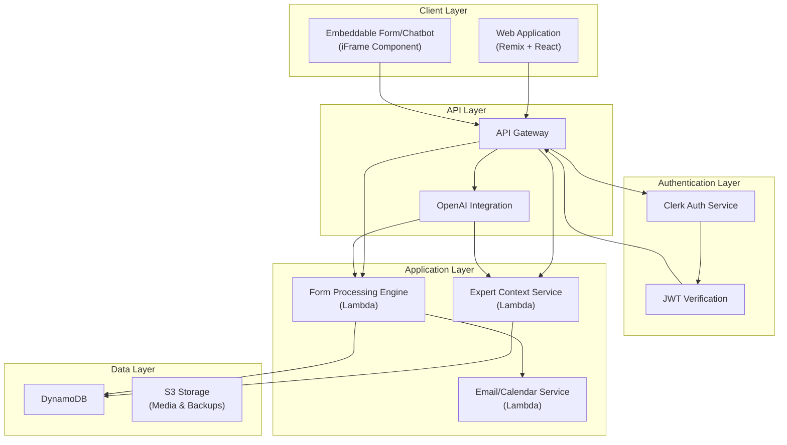
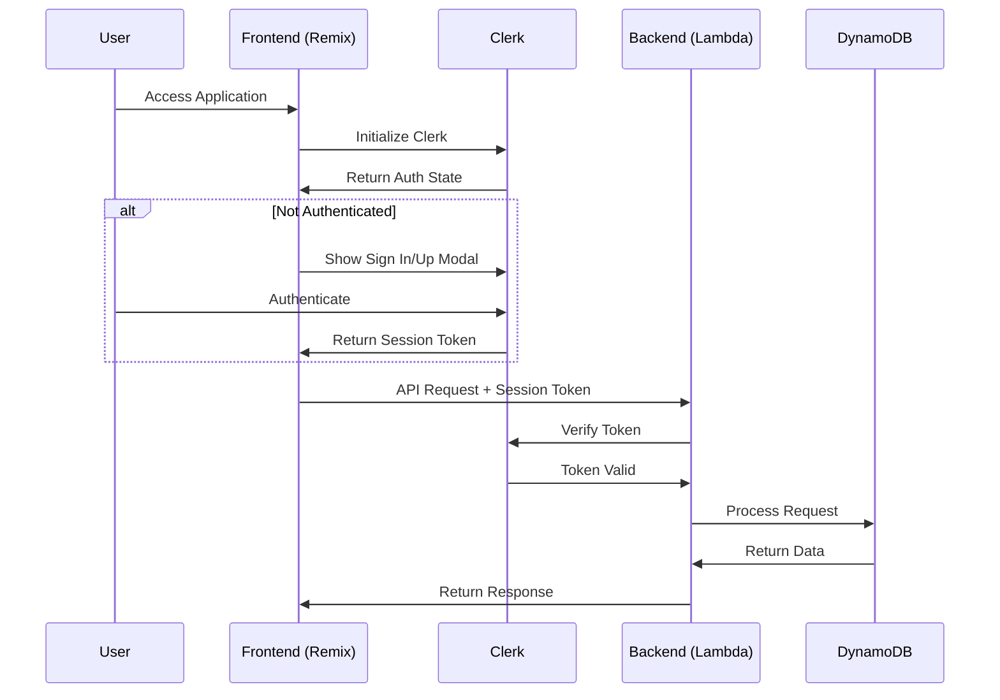
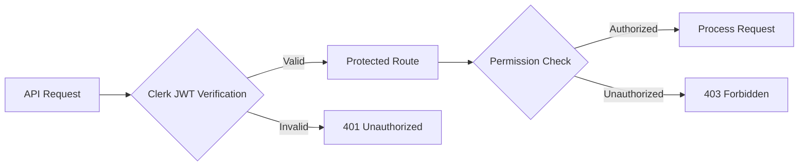
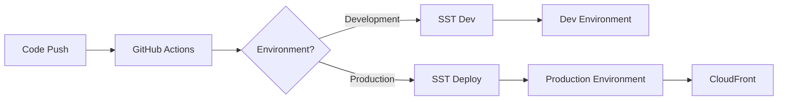

# AI-Compass System Design

## System Architecture Overview

### High-Level Architecture



## Component Breakdown

### 1. Authentication Flow (Clerk)



### 2. Data Models

#### Experts Table
```typescript
interface Expert {
  pk: string;                 // expert#${userId}
  sk: string;                 // metadata
  clerkUserId: string;        // Clerk user identifier
  email: string;
  name: string;
  expertise: string[];
  aiPersona: {
    context: string;         // AI-generated expert context
    understandingScore: number;
    lastUpdated: number;
  };
  settings: {
    widgetTheme: object;
    branding: object;
    notifications: object;
  };
}
```

#### Submissions Table
```typescript
interface Submission {
  pk: string;                // submission#${id}
  sk: string;                // expert#${expertId}
  businessDetails: {
    name: string;
    email: string;
    requirements: string;
  };
  aiResponse: {
    analysis: string;
    actionPlan: string[];
    qualification: {
      score: number;
      factors: string[];
    };
  };
  status: 'new' | 'processed' | 'scheduled';
  timestamp: number;
}
```

### 3. Authentication & Security

#### Clerk Integration
- User management through Clerk dashboard
- JWT-based authentication
- Social login providers (Google, GitHub)
- Session management
- Role-based access control (RBAC)

#### Security Measures


## Infrastructure (SST + AWS)

### AWS Services Used
- CloudFront for CDN
- Lambda for serverless functions
- DynamoDB for database
- S3 for file storage
- SST for infrastructure management

### Deployment Flow



## API Endpoints

### Expert Management
```
/api/v1/
  ├── auth/
  │   └── verify-session
  ├── experts/
  │   ├── profile
  │   ├── ai-persona
  │   └── leads
  ├── forms/
  │   ├── submit
  │   ├── action-plan
  │   └── schedule
  └── widgets/
      ├── config
      └── analytics
```

## Performance Optimization

### Caching Strategy
- CloudFront caching for static assets
- DynamoDB DAX for frequently accessed data
- Client-side caching of user session

### Monitoring
- CloudWatch for logs and metrics
- Clerk analytics for auth events
- Custom analytics for business metrics

## Development Workflow

### Local Development
1. Start Remix development server
2. Run SST in development mode
3. Connect to local DynamoDB
4. Use Clerk development keys

### Production Deployment
1. Code push to main branch
2. SST deployment
3. CloudFront invalidation
4. Environment variable updates

## Error Handling

### Client-Side
- Clerk authentication errors
- Form validation errors
- API response errors

### Server-Side
- Lambda error monitoring
- DynamoDB error handling
- Authentication failures

## Future Enhancements

### Phase 1
- [ ] Enhanced analytics dashboard
- [ ] Multi-language support
- [ ] Advanced form customization

### Phase 2
- [ ] AI model fine-tuning
- [ ] Real-time chat support
- [ ] Integration marketplace